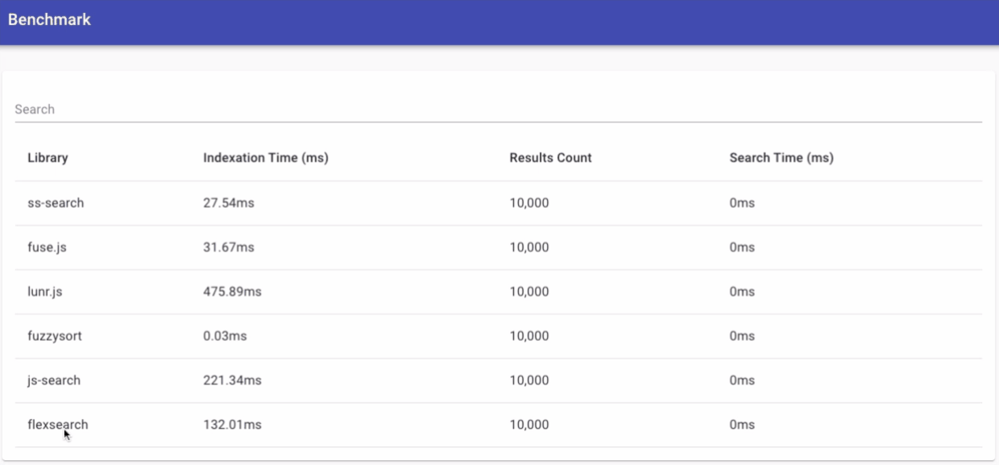

# s(imply)s(tupid)-search
### The most basic, yet powerful text search.
### Stop searching, start finding.

- Easy to use; will return you appropriate results out of the box, no need to configure anything
- Search local array of objects as easily as never before
- Automatic indexing
- Will return exactly what you are looking for
- Very small size; only depends on 5 lodash functions which are extracted using rollup, which means we have a zero dependency lbirary

## Demo


If you're not convinced yet, take a look at this interactive
[demo](https://ss-search.netlify.app/). 

## Install
ss-search is available on [npm](https://www.npmjs.com/package/ss-search). It can be installed with the following command:

`npm install ss-search` 

## Usage

### Basic
```javascript
import { search } from "ss-search"

const data = [
     {
         number: 1,
         text: "A search function should be fast",
     },
     {
         number: 2,
         text: "A search function should provide accurate results"
     },
]
const searchKeys = ["text"] 
const searchText = "fast search"

const results = search(data, searchKeys, searchText)
// results: [{ number: 1, text: "A search function should be fast" }]
```

Yes. It is that simple, no need to configure anything, it works out of the box.

### Data Types

Almost all data types are supported [boolean, number, string, object, array].
```javascript
// This dataset will be used as a common starting point for our type examples
const data = [
    {
        boolean: true,
        number: 1,
        string: "search",
        object: { nestedProperty: "nested value" },
        array: ["value1", "value2"],
        arrayObjects: [{ arrayObjectProperty: "array object value" }],
    }
]
```

#### Boolean
```javascript
const results = search(data, ["boolean"], "true")
// results: will return our original dataset
```

#### Number
```javascript
const results = search(data, ["number"], "1")
// results: will return our original dataset
```

#### String
```javascript
const results = search(data, ["string"], "search")
// results: will return our original dataset
```

#### Object

Providing a key which refers to an object will stringify that object using JSON.stringify

```javascript
const results = search(data, ["object"], "property")
// results: will return our original dataset as it matches the property key "nestedProperty" of our object
```

If you want to access a nested property of an object to extract only a single value

```javascript
const results = search(data, ["object.nestedProperty"], "property")
// results: will return an empty array as we extracted the value of our nested object
// if we had searched for "nested value" we would of had the original dataset
```

#### Array

Providing a key which refers to an array will stringify that array using JSON.stringify
         
```javascript
const results = search(data, ["array"], "value2")
// results: will return our original dataset
```

If you have an array of objects on which you want to search all properties

```javascript
const results = search(data, ["arrayObjects"], "arrayObjectProperty")
// results: will return an our original dataset as it's treated just like a regular array
// thus the arrayObjectProperty is part of the searchable text
```

If you have an array of objects where you want only specific properties to be searchable

```javascript
const results = search(data, ["arrayObjects[arrayObjectProperty]"], "arrayObjectProperty")
// results: will return an empty array as we extracted the value of our nested array of objects
// if we had searched for "value object" we would of had the original dataset 
```

### Benchmark

How does it compare to other search libraries? Test out for yourself with this interactive [benchmark](https://ss-search.netlify.app/benchmark) ;)

